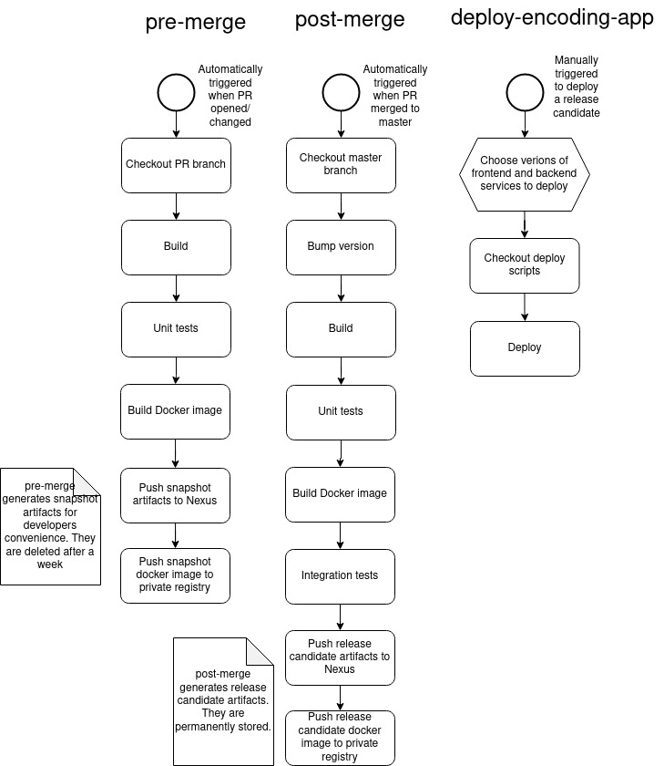

# Overview

This projects contains a Jenkins shared library which is used to define CICD pipelines for **encoding-app** and **online-boutique**.  

# Pipelines

* Pipelines and helper functions are defined in `vars` directory
* **encoding-app** consists of [backend](https://github.com/anea-11/x265) and [frontend](https://github.com/anea-11/frontend-demo) service; Pipelines used for **encoding-app**:

| Pipeline          | Description                                                                |
|------------------ | -------------------------------------------------------------------------  |
| encoderPreMerge   | automatically triggered when a PR is opened on backend service             |
| encoderPostMerge  | automatically triggered when there's a merge to master on backend service  |
| frontendPreMerge  | automatically triggered when a PR is opened on frontend service            |
| frontendPostMerge | automatically triggered when there's a merge to master on frontend service |
| deployEncodingApp | manually triggered to deploy **encoding-app**                              |

* **online-boutique** is Google's microservices demo app. Docker images used for deploying services are located in Google's public registry; Pipeline used for deploying:

| Pipeline                  | Description                                            |
|-------------------------- | -----------------------------------------------------  |
| deployOnlineBoutiqueToEKS | manually triggered to deploy app to EKS cluster on AWS |

# encoding-app pipelines

* pre-merge and post-merge pipelines for both services follow the same structure, outlined below

